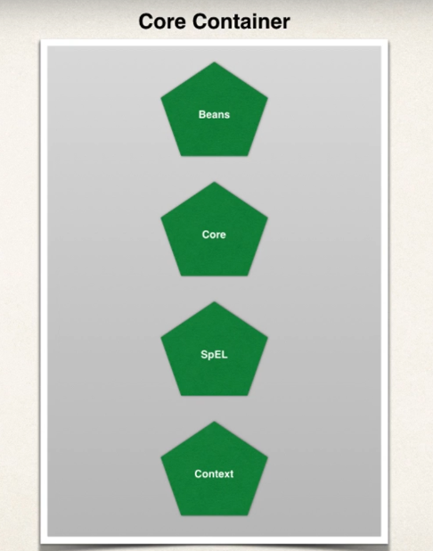
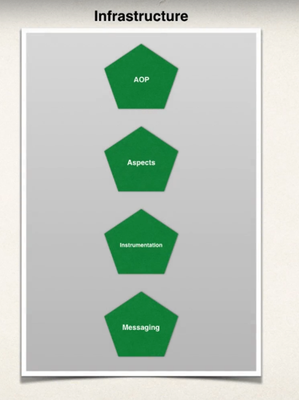
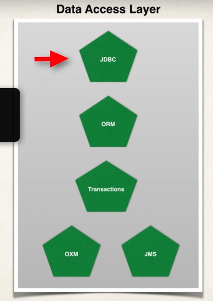
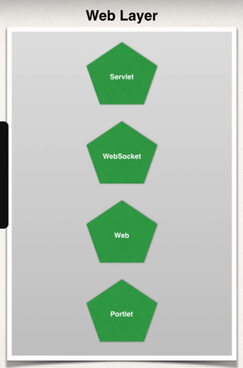
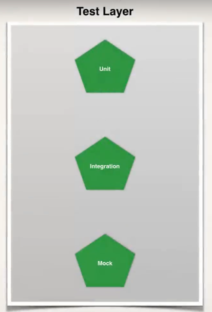

# Spring Overview

## Why Spring?
- Previously Java enterprise applications were built with Java EE (initially named as J2EE)

- It was created in 1999 with support for JSP and Java servlets

- Early Java Beans (v1 and v2) were extremely complex, tedious and error prone. In addition, Entity Beans had poor performance.

- Spring was founded by Rod Johnson as an alternative to J2EE in 2004

- We had the following iterations of the Spring framework:

    1) Spring 1.0 in 2004
    2) Spring 2.0 in 2006
    3) Spring 3.0 in 2009
    4) Spring 4.0 in 2013
    5) Spring 5.0 in 2017

- Although Java EE did improve, the motivation and adoption for Spring was rampant!

## Spring Core Framework

- The official website of Spring website is [here](https://spring.io/)

### Goals of Spring:

- Lightweight development with POJO (Plain Old Java Objects)

- Dependency injection to promote loose coupling

- Declarative programming with Aspect-Oriented-Programming

- Minimise boilerplated code

### Big Picture:

#### Core Container:

- Manages creation of Beans and bean dependencies.

#### Infrastructure:

- This allows us to create application wide functionalities such as Logging, security, transactions declaritively on objects

##### Data Access Layer:

- JDBC helper classes allow us to easily to connect to databases

- ORM integrates with Hibernate and JPA

- JMS (Java Messaging Service) for sending async messages to a message broker

#### Spring Web Layer:

- This is the home of the Spring MVC framework

#### Test layer:

- Spring framework has baked in testing framework which allows for unit testing and mocking implementations

## Spring Projects

- There are Spring modules which are built on the core Spring Framework for things such as web services, data, cloud, secruity

- All projects can be viewed [here](https://spring.io/projects)